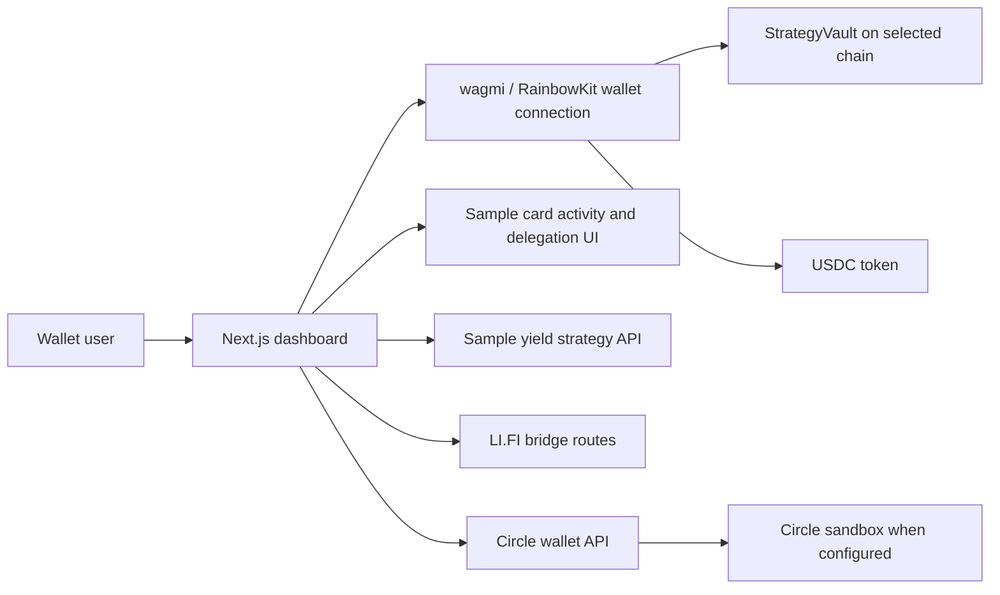

# CardFi Yield Manager

**Turn every swipe into smart yield.** CardFi is a MetaMask Card hackathon prototype for viewing card activity alongside a USDC yield vault. Its dashboard brings wallet balances, vault deposits and withdrawals, spending insights, strategy discovery, and cross-chain tools into one place.

## Watch CardFi


**[Play the complete 22-second walkthrough with sound](https://raw.githubusercontent.com/Kartik2004sharma/Cardfi/main/brag-output/brag.mp4)** · [Video file in this repository](brag-output/brag.mp4)

The walkthrough shows the dashboard, sample card activity, and the USDC deposit form. Its balances are illustrative; it stops before any wallet signature or completed transaction.

## Why CardFi exists

CardFi explores a simple idea: keep USDC available for spending while making the rest visible and manageable in a yield vault. The product puts MetaMask Card activity next to DeFi controls so a user can inspect spending, review a vault position, and decide when to approve, deposit, or withdraw USDC. The code also includes a strategy manager with configurable rebalancing, but the current app does not automatically invest from live card transactions.

## What is in the app

| Area | What it does today |
| --- | --- |
| Dashboard | Connects a wallet, reads configured USDC and vault contracts, shows balances, vault metrics, a deposit preview, approval/deposit controls, withdrawal controls, and contract events. |
| MetaMask Card | Shows spending categories, rewards, recent activity, and a delegation interface. Recent card activity is sample data, not a live card feed. |
| Strategies | Lists sample yield opportunities with APY, TVL, risk, chain, and deposit limits. The API validates deposit parameters; it does not execute an on-chain deposit. |
| Bridge | Presents testnet route discovery and execution controls through LI.FI integration. Availability depends on supported routes, wallet, and network configuration. |
| Circle wallet API | Exposes wallet creation, balances, transfers, and transaction status through server-side routes. Without a Circle API key, wallet creation uses a demo response; card auto top-up is not implemented. |
| Swap and other dashboard pages | Provide prototype interfaces for related flows. The swap page calculates mock quotes and simulates completion rather than sending a trade. |

The repository also includes a testnet USDC page, contract views, rewards, transaction, liquidity, and settings pages. Some of these views use static or example values.

## Main user flow

1. Open `/dashboard` and connect a wallet with the button in the navigation bar.
2. Select a supported network with configured USDC and vault addresses.
3. Review USDC balance, vault assets, share price, fees, and the CardFi card activity panel.
4. Enter a USDC amount. The vault form previews shares and, in live mode, asks for USDC approval before deposit.
5. Redeem vault shares to withdraw when a deployed vault is available.

The browser wallet signs live contract transactions. The server's yield strategy endpoint only returns parameters; its successful response is not proof of a deposit.

## How it is built



- **Frontend:** Next.js 16 App Router, React 19, TypeScript, Tailwind CSS, Radix UI, and Recharts.
- **Wallet and chain access:** wagmi, viem, RainbowKit, and MetaMask SDK.
- **Integrations:** LI.FI route tools, Circle API routes, and MetaMask delegation code.
- **Smart contracts:** Solidity 0.8.20 with OpenZeppelin, developed and tested with Hardhat.

### Smart contracts

| Contract | Purpose |
| --- | --- |
| `StrategyVault.sol` | USDC deposits and redemptions, vault shares, fee accounting, APY reporting, and delayed emergency withdrawal. This is the vault ABI used by the dashboard. |
| `YieldManager.sol` | Strategy registry, position tracking, Aave/Compound routing logic, rebalance settings, keeper authorization, and emergency exit. |
| `YieldVault.sol` and `YieldVaultFactory.sol` | Alternative vault and factory contracts included in the repository. |
| `MockUSDC.sol` and `MockStrategyVault.sol` | Local testing and demonstration contracts. |

The contract sources and the frontend are not evidence of a public deployment. A working live vault needs deployed addresses for the selected network and a compatible token balance.

## Run locally

Prerequisites: Node.js with npm, a browser wallet for wallet flows, and a WalletConnect project ID for reliable wallet connection.

```bash
git clone https://github.com/Kartik2004sharma/Cardfi.git
cd Cardfi
npm ci
cp .env.example .env.local
npm run dev
```

Visit [http://localhost:3000](http://localhost:3000). The landing page is `/`; the vault dashboard is `/dashboard`.

The example environment file contains placeholders. Set `NEXT_PUBLIC_WALLET_CONNECT_PROJECT_ID` to your own project ID. For on-chain vault operations, set the USDC and vault addresses for the network you are using. The frontend currently reads `NEXT_PUBLIC_SEPOLIA_*`, `NEXT_PUBLIC_BASE_SEPOLIA_*`, or `NEXT_PUBLIC_LOCAL_*` addresses from `lib/web3-config.ts`; a zero vault address is a placeholder, not a deployed contract.

| Variable | Used for |
| --- | --- |
| `NEXT_PUBLIC_DEMO_MODE` | Set to `true` to simulate vault deposits and withdrawals on Sepolia or Polygon Mumbai; demo positions are stored in browser local storage. Default is `false`. |
| `NEXT_PUBLIC_WALLET_CONNECT_PROJECT_ID` | Wallet connection through RainbowKit. |
| `NEXT_PUBLIC_*_USDC_ADDRESS`, `NEXT_PUBLIC_*_VAULT_ADDRESS` | Token and vault contract addresses for the selected network. |
| `CIRCLE_API_KEY`, `CIRCLE_ENVIRONMENT`, `CIRCLE_API_URL` | Server-side Circle wallet integration. Keep the API key private. |
| `LIFI_API_KEY` | Optional LI.FI configuration for routes that require a key. |
| `PRIVATE_KEY` and RPC URLs | Hardhat deployment scripts only. Never commit a real private key. |

To run the contract checks:

```bash
npx hardhat compile
npx hardhat test
```

## Repository map

- `app/` — landing page, dashboard routes, and API routes for yield, wallet, and LI.FI operations.
- `components/` — dashboard, card, bridge, wallet, and interface components.
- `hooks/` — vault reads and writes, demo vault state, MetaMask, and bridge hooks.
- `lib/` — network configuration and integration services.
- `contracts/`, `test/`, `scripts/` — Solidity contracts, Hardhat tests, and deployment scripts.
- `brag-output/brag.mp4` — the CardFi product walkthrough shown above.

## Current limitations

Card activity, several analytics panels, and the yield strategy catalog are illustrative. The strategy API's deposit response does not submit a transaction. The swap page is a simulation. Demo vault mode does not move USDC on-chain. Circle actions and LI.FI routes depend on external configuration, and no public contract addresses are supplied in this repository. Treat the shown APYs and rewards as examples, not live returns.

## License

No license has been added to this repository.
